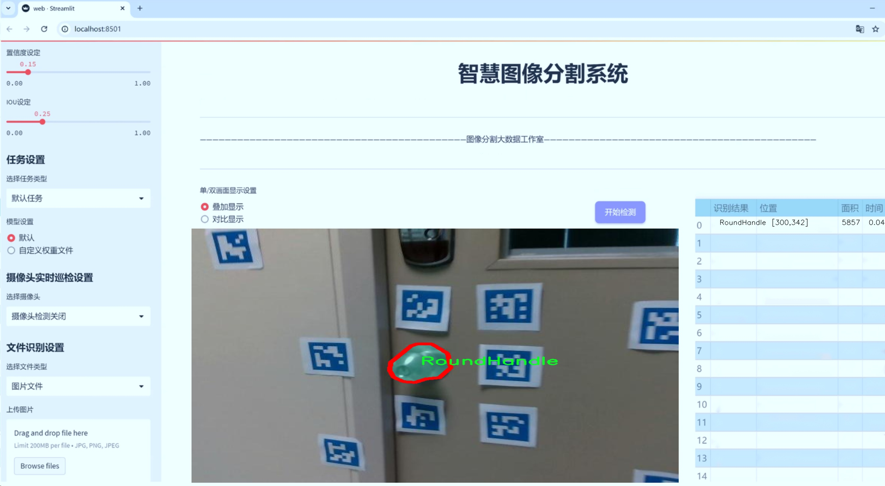
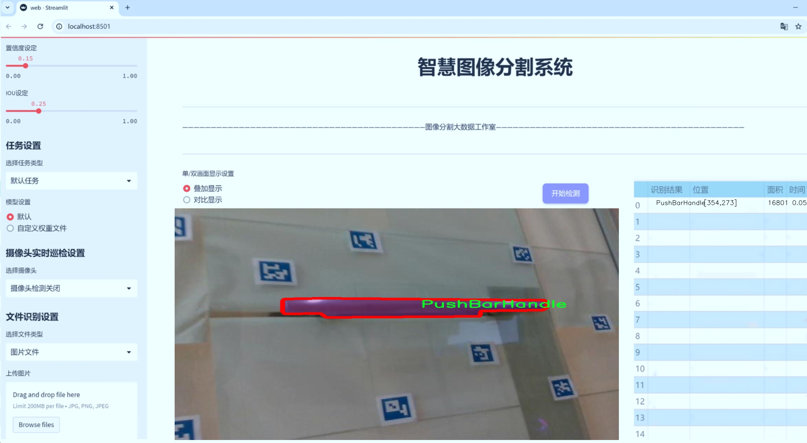
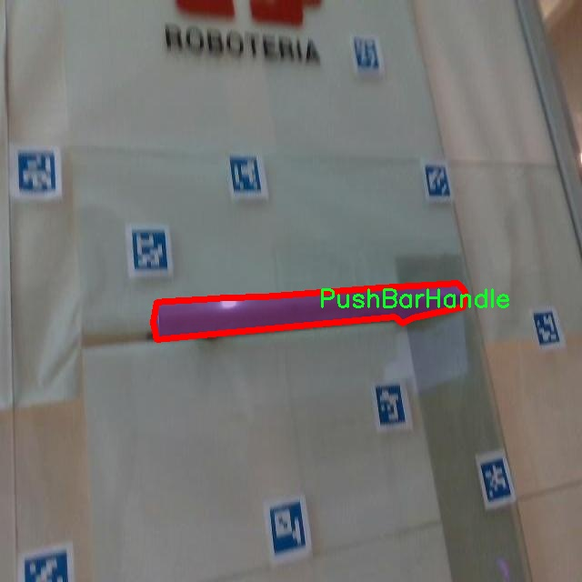
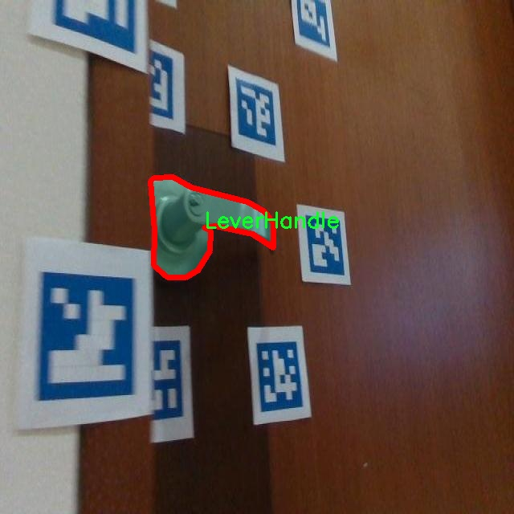
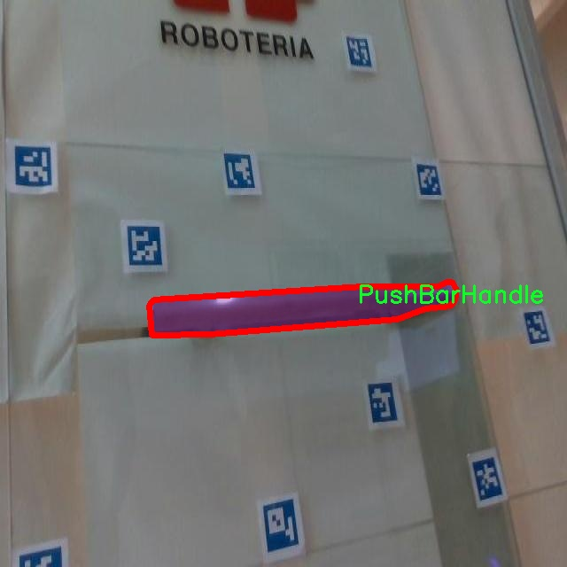
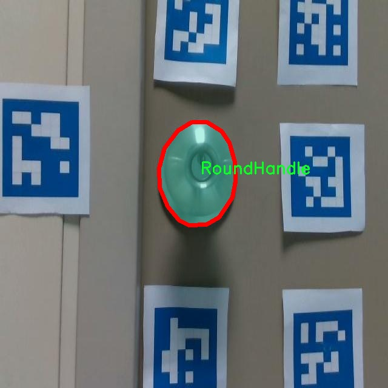
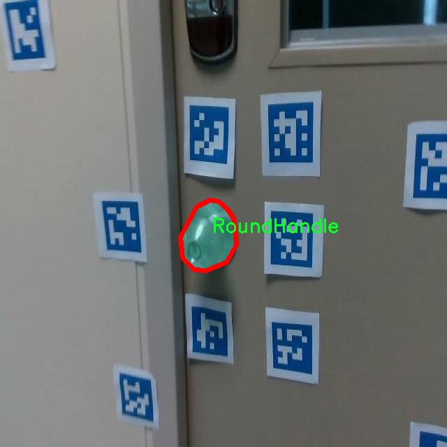

# 门把手图像分割系统源码＆数据集分享
 [yolov8-seg-EfficientFormerV2＆yolov8-seg-C2f-ContextGuided等50+全套改进创新点发刊_一键训练教程_Web前端展示]

### 1.研究背景与意义

项目参考[ILSVRC ImageNet Large Scale Visual Recognition Challenge](https://gitee.com/YOLOv8_YOLOv11_Segmentation_Studio/projects)

项目来源[AAAI Global Al lnnovation Contest](https://kdocs.cn/l/cszuIiCKVNis)

研究背景与意义

随着智能家居和自动化技术的迅速发展，门把手作为人机交互的重要接口，其设计与功能的优化显得尤为重要。门把手不仅承担着开启和关闭门的基本功能，还在一定程度上影响着用户的使用体验和安全性。因此，针对门把手的图像分割技术研究，尤其是基于深度学习的实例分割方法，具有重要的理论意义和实际应用价值。

近年来，深度学习技术在计算机视觉领域取得了显著进展，尤其是目标检测和图像分割任务中，YOLO（You Only Look Once）系列模型因其高效性和准确性而备受关注。YOLOv8作为该系列的最新版本，结合了更先进的网络结构和优化算法，能够在保证实时性的同时提升分割精度。然而，针对特定应用场景的模型改进仍然是一个亟待解决的问题。针对门把手图像分割的研究，能够为YOLOv8的应用拓展提供新的思路。

本研究将基于改进的YOLOv8模型，构建一个门把手图像分割系统。我们使用的数据集包含3500张图像，涵盖了三种门把手类型：杠杆把手（LeverHandle）、推杆把手（PushBarHandle）和圆形把手（RoundHandle）。这一数据集的多样性和丰富性为模型的训练和验证提供了坚实的基础。通过对不同类型门把手的实例分割，系统不仅能够识别出门把手的具体类别，还能精确地定位其在图像中的位置，为后续的智能识别和交互提供数据支持。

门把手的图像分割研究不仅具有学术价值，还具有广泛的应用前景。在智能家居、安防监控、机器人视觉等领域，门把手的准确识别和分割能够提升系统的智能化水平。例如，在智能门锁系统中，准确识别门把手的类型和位置，可以实现更为灵活的开锁方式；在机器人导航中，门把手的识别能够帮助机器人更好地理解环境，进行自主决策。此外，该研究还能够为门把手的设计提供数据支持，推动人机交互界面的优化。

综上所述，基于改进YOLOv8的门把手图像分割系统的研究，不仅填补了当前在这一细分领域的研究空白，还为智能家居及相关技术的发展提供了新的思路和方法。通过对门把手图像的深入分析与处理，本研究将推动计算机视觉技术在实际应用中的进一步落地，为实现更智能、更人性化的生活环境贡献力量。

### 2.图片演示






##### 注意：由于此博客编辑较早，上面“2.图片演示”和“3.视频演示”展示的系统图片或者视频可能为老版本，新版本在老版本的基础上升级如下：（实际效果以升级的新版本为准）

  （1）适配了YOLOV8的“目标检测”模型和“实例分割”模型，通过加载相应的权重（.pt）文件即可自适应加载模型。

  （2）支持“图片识别”、“视频识别”、“摄像头实时识别”三种识别模式。

  （3）支持“图片识别”、“视频识别”、“摄像头实时识别”三种识别结果保存导出，解决手动导出（容易卡顿出现爆内存）存在的问题，识别完自动保存结果并导出到tempDir中。

  （4）支持Web前端系统中的标题、背景图等自定义修改，后面提供修改教程。

  另外本项目提供训练的数据集和训练教程,暂不提供权重文件（best.pt）,需要您按照教程进行训练后实现图片演示和Web前端界面演示的效果。

### 3.视频演示

[3.1 视频演示](https://www.bilibili.com/video/BV16v1VYxEPz/)

### 4.数据集信息展示

##### 4.1 本项目数据集详细数据（类别数＆类别名）

nc: 3
names: ['LeverHandle', 'PushBarHandle', 'RoundHandle']


##### 4.2 本项目数据集信息介绍

数据集信息展示

在本研究中，我们使用了名为“To get mask image”的数据集，旨在改进YOLOv8-seg模型在门把手图像分割任务中的表现。该数据集专注于门把手的不同类型，包含三种主要类别，分别是“LeverHandle”（杠杆把手）、“PushBarHandle”（推杆把手）和“RoundHandle”（圆形把手）。这些类别的选择不仅反映了现实生活中常见的门把手类型，还为模型提供了丰富的样本，以便于其在复杂场景下的学习和识别。

数据集的构建过程经过精心设计，确保了样本的多样性和代表性。每个类别的图像均来自不同的环境和光照条件，以增强模型的鲁棒性。例如，LeverHandle类别的图像可能包含不同材质和颜色的杠杆把手，PushBarHandle类别则可能涵盖各种形状和尺寸的推杆把手，而RoundHandle类别则专注于不同风格的圆形把手。这种多样性使得模型在训练过程中能够学习到更加全面的特征，从而在实际应用中具备更强的适应能力。

在数据集的标注方面，采用了高精度的分割掩码，以确保每个类别的边界清晰可辨。通过对每个图像进行细致的标注，数据集为YOLOv8-seg模型提供了丰富的训练样本，使其能够有效地学习到不同把手的形状、纹理和颜色特征。这种精确的标注不仅提高了模型的分割精度，也为后续的模型评估提供了可靠的基准。

此外，数据集还包含了多种不同的背景，以模拟真实世界中的应用场景。无论是在室内还是室外，数据集中的图像都展示了门把手在不同环境下的表现。这种背景的多样性有助于模型在面对不同的使用场景时，能够保持良好的分割效果。例如，在一个明亮的室内环境中，门把手的颜色可能与墙壁产生强烈对比，而在阴暗的户外环境中，门把手的细节可能会被遮蔽。通过这种方式，数据集为模型的训练提供了更为全面的挑战，使其在实际应用中能够更好地应对各种复杂情况。

总的来说，“To get mask image”数据集为改进YOLOv8-seg的门把手图像分割系统提供了坚实的基础。通过精心挑选的类别、丰富的样本和高质量的标注，该数据集不仅增强了模型的学习能力，也为后续的研究和应用奠定了良好的基础。随着对数据集的深入分析和模型的不断优化，我们期待能够在门把手图像分割领域取得显著的进展，推动相关技术的进一步发展。











### 5.全套项目环境部署视频教程（零基础手把手教学）

[5.1 环境部署教程链接（零基础手把手教学）](https://www.bilibili.com/video/BV1jG4Ve4E9t/?vd_source=bc9aec86d164b67a7004b996143742dc)


[5.2 安装Python虚拟环境创建和依赖库安装视频教程链接（零基础手把手教学）](https://www.bilibili.com/video/BV1nA4VeYEze/?vd_source=bc9aec86d164b67a7004b996143742dc)

### 6.手把手YOLOV8-seg训练视频教程（零基础小白有手就能学会）

[6.1 手把手YOLOV8-seg训练视频教程（零基础小白有手就能学会）](https://www.bilibili.com/video/BV1cA4VeYETe/?vd_source=bc9aec86d164b67a7004b996143742dc)


按照上面的训练视频教程链接加载项目提供的数据集，运行train.py即可开始训练



     Epoch   gpu_mem       box       obj       cls    labels  img_size
     1/200     0G   0.01576   0.01955  0.007536        22      1280: 100%|██████████| 849/849 [14:42<00:00,  1.04s/it]
               Class     Images     Labels          P          R     mAP@.5 mAP@.5:.95: 100%|██████████| 213/213 [01:14<00:00,  2.87it/s]
                 all       3395      17314      0.994      0.957      0.0957      0.0843

     Epoch   gpu_mem       box       obj       cls    labels  img_size
     2/200     0G   0.01578   0.01923  0.007006        22      1280: 100%|██████████| 849/849 [14:44<00:00,  1.04s/it]
               Class     Images     Labels          P          R     mAP@.5 mAP@.5:.95: 100%|██████████| 213/213 [01:12<00:00,  2.95it/s]
                 all       3395      17314      0.996      0.956      0.0957      0.0845

     Epoch   gpu_mem       box       obj       cls    labels  img_size
     3/200     0G   0.01561    0.0191  0.006895        27      1280: 100%|██████████| 849/849 [10:56<00:00,  1.29it/s]
               Class     Images     Labels          P          R     mAP@.5 mAP@.5:.95: 100%|███████   | 187/213 [00:52<00:00,  4.04it/s]
                 all       3395      17314      0.996      0.957      0.0957      0.0845


### 7.50+种全套YOLOV8-seg创新点代码加载调参视频教程（一键加载写好的改进模型的配置文件）

[7.1 50+种全套YOLOV8-seg创新点代码加载调参视频教程（一键加载写好的改进模型的配置文件）](https://www.bilibili.com/video/BV1Hw4VePEXv/?vd_source=bc9aec86d164b67a7004b996143742dc)

### 8.YOLOV8-seg图像分割算法原理

原始YOLOv8-seg算法原理

YOLOv8-seg算法是YOLO系列中最新的目标检测与分割模型，代表了计算机视觉领域的前沿技术。它不仅继承了YOLO系列一贯的高效性和准确性，还在多个方面进行了创新和优化，使其在目标检测和实例分割任务中表现出色。YOLOv8-seg的设计理念是将目标检测与图像分割有机结合，利用深度学习的强大能力，实现对图像中目标的精确定位和分割。

首先，YOLOv8-seg算法的骨干网络（backbone）采用了跨阶段局部网络（CSP）结构，保持了YOLOv5中的优良设计，同时进行了进一步的优化。具体而言，YOLOv8-seg在C3模块的基础上引入了更轻量的C2f模块，这一改进不仅减少了计算量，还提高了特征提取的效率。C2f模块通过增加跳层连接和Split操作，能够更好地捕捉图像中的多尺度特征，为后续的目标检测和分割提供了更为丰富的上下文信息。

在特征增强网络（neck）方面，YOLOv8-seg采用了特征金字塔网络（PAN-FPN）的思想，这一结构能够有效地融合来自不同层次的特征图，增强模型对小目标和复杂场景的适应能力。通过这种特征融合，YOLOv8-seg能够在不同尺度的目标上保持较高的检测精度，特别是在处理高分辨率图像时，模型的表现尤为突出。

YOLOv8-seg的检测头（head）部分是其最为显著的创新之一。与传统的耦合头不同，YOLOv8-seg采用了解耦头结构，将分类和回归任务分开处理。这种设计使得模型在复杂场景下能够更专注于各自的任务，从而减少了定位不准和分类错误的情况。此外，YOLOv8-seg引入了Anchor-free的目标检测方法，省去了预定义锚点框的繁琐过程，直接通过回归方式预测目标的位置和大小。这一变化使得模型在处理不同形状和尺度的目标时更加灵活，能够快速聚焦于目标的实际边界。

在损失函数的设计上，YOLOv8-seg也进行了创新。它采用了变焦损失（Focal Loss）来计算分类损失，结合数据平均保真度损失和完美交并比损失来评估边界框的准确性。这种新的损失策略能够有效地缓解类别不平衡问题，提高模型在难以分类的目标上的表现。通过对损失函数的优化，YOLOv8-seg在训练过程中能够更好地调整权重，从而实现更高的检测精度。

YOLOv8-seg还特别关注了实例分割任务。通过对目标的精确分割，模型能够在检测的基础上提供更为细致的语义信息。这一能力在实际应用中具有重要意义，尤其是在需要对目标进行精细处理的场景，如医学影像分析、自动驾驶等领域。YOLOv8-seg通过对每个目标进行像素级的分割，不仅提高了目标检测的准确性，还增强了模型的应用范围。

此外，YOLOv8-seg在训练和推理速度上也进行了优化。得益于其轻量化的设计，YOLOv8-seg能够在各种硬件平台上高效运行，从CPU到GPU均能保持良好的性能。这一特性使得YOLOv8-seg在实时检测任务中表现出色，能够满足现代应用对速度和准确性的双重需求。

综上所述，YOLOv8-seg算法通过对骨干网络、特征增强网络、检测头和损失函数等多个方面的创新与优化，成功地将目标检测与实例分割结合在一起。其高效的特征提取能力、灵活的目标定位方法以及精确的分割能力，使得YOLOv8-seg在计算机视觉领域中占据了重要地位。随着技术的不断进步，YOLOv8-seg有望在更多实际应用中发挥重要作用，为各类视觉任务提供强有力的支持。


### 9.系统功能展示（检测对象为举例，实际内容以本项目数据集为准）

图9.1.系统支持检测结果表格显示

  图9.2.系统支持置信度和IOU阈值手动调节

  图9.3.系统支持自定义加载权重文件best.pt(需要你通过步骤5中训练获得)

  图9.4.系统支持摄像头实时识别

  图9.5.系统支持图片识别

  图9.6.系统支持视频识别

  图9.7.系统支持识别结果文件自动保存

  图9.8.系统支持Excel导出检测结果数据


### 10.50+种全套YOLOV8-seg创新点原理讲解（非科班也可以轻松写刊发刊，V11版本正在科研待更新）

#### 10.1 由于篇幅限制，每个创新点的具体原理讲解就不一一展开，具体见下列网址中的创新点对应子项目的技术原理博客网址【Blog】：


[10.1 50+种全套YOLOV8-seg创新点原理讲解链接](https://gitee.com/qunmasj/good)

#### 10.2 部分改进模块原理讲解(完整的改进原理见上图和技术博客链接)【如果此小节的图加载失败可以通过CSDN或者Github搜索该博客的标题访问原始博客，原始博客图片显示正常】

### YOLOv8简介

按照官方描述，YOLOv8 是一个 SOTA 模型，它建立在以前 YOLO 版本的成功基础上，并引入了新的功能和改进，以进一步提升性能和灵活性。具体创新包括一个新的骨干网络、一个新的 Ancher-Free 检测头和一个新的损失函数，可以在从 CPU 到 GPU 的各种硬件平台上运行。

不过 ultralytics 并没有直接将开源库命名为 YOLOv8，而是直接使用 ultralytics 这个词，原因是 ultralytics 将这个库定位为算法框架，而非某一个特定算法，一个主要特点是可扩展性。其希望这个库不仅仅能够用于 YOLO 系列模型，而是能够支持非 YOLO 模型以及分类分割姿态估计等各类任务。
总而言之，ultralytics 开源库的两个主要优点是：

融合众多当前 SOTA 技术于一体
未来将支持其他 YOLO 系列以及 YOLO 之外的更多算法


下表为官方在 COCO Val 2017 数据集上测试的 mAP、参数量和 FLOPs 结果。可以看出 YOLOv8 相比 YOLOv5 精度提升非常多，但是 N/S/M 模型相应的参数量和 FLOPs 都增加了不少，从上图也可以看出相比 YOLOV5 大部分模型推理速度变慢了。


额外提一句，现在各个 YOLO 系列改进算法都在 COCO 上面有明显性能提升，但是在自定义数据集上面的泛化性还没有得到广泛验证，至今依然听到不少关于 YOLOv5 泛化性能较优异的说法。对各系列 YOLO 泛化性验证也是 MMYOLO 中一个特别关心和重点发力的方向。

### YOLO-MS简介
实时目标检测，以YOLO系列为例，已在工业领域中找到重要应用，特别是在边缘设备（如无人机和机器人）中。与之前的目标检测器不同，实时目标检测器旨在在速度和准确性之间追求最佳平衡。为了实现这一目标，提出了大量的工作：从第一代DarkNet到CSPNet，再到最近的扩展ELAN，随着性能的快速增长，实时目标检测器的架构经历了巨大的变化。

尽管性能令人印象深刻，但在不同尺度上识别对象仍然是实时目标检测器面临的基本挑战。这促使作者设计了一个强大的编码器架构，用于学习具有表现力的多尺度特征表示。具体而言，作者从两个新的角度考虑为实时目标检测编码多尺度特征：

从局部视角出发，作者设计了一个具有简单而有效的分层特征融合策略的MS-Block。受到Res2Net的启发，作者在MS-Block中引入了多个分支来进行特征提取，但不同的是，作者使用了一个带有深度卷积的 Inverted Bottleneck Block块，以实现对大Kernel的高效利用。

从全局视角出发，作者提出随着网络加深逐渐增加卷积的Kernel-Size。作者在浅层使用小Kernel卷积来更高效地处理高分辨率特征。另一方面，在深层中，作者采用大Kernel卷积来捕捉广泛的信息。

基于以上设计原则，作者呈现了作者的实时目标检测器，称为YOLO-MS。为了评估作者的YOLO-MS的性能，作者在MS COCO数据集上进行了全面的实验。还提供了与其他最先进方法的定量比较，以展示作者方法的强大性能。如图1所示，YOLO-MS在计算性能平衡方面优于其他近期的实时目标检测器。


具体而言，YOLO-MS-XS在MS COCO上获得了43%+的AP得分，仅具有450万个可学习参数和8.7亿个FLOPs。YOLO-MS-S和YOLO-MS分别获得了46%+和51%+的AP，可学习参数分别为810万和2220万。此外，作者的工作还可以作为其他YOLO模型的即插即用模块。通常情况下，作者的方法可以将YOLOv8的AP从37%+显著提高到40%+，甚至还可以使用更少的参数和FLOPs。


#### Multi-Scale Building Block Design
CSP Block是一个基于阶段级梯度路径的网络，平衡了梯度组合和计算成本。它是广泛应用于YOLO系列的基本构建块。已经提出了几种变体，包括YOLOv4和YOLOv5中的原始版本，Scaled YOLOv4中的CSPVoVNet，YOLOv7中的ELAN，以及RTMDet中提出的大Kernel单元。作者在图2(a)和图2(b)中分别展示了原始CSP块和ELAN的结构。


上述实时检测器中被忽视的一个关键方面是如何在基本构建块中编码多尺度特征。其中一个强大的设计原则是Res2Net，它聚合了来自不同层次的特征以增强多尺度表示。然而，这一原则并没有充分探索大Kernel卷积的作用，而大Kernel卷积已经在基于CNN的视觉识别任务模型中证明有效。将大Kernel卷积纳入Res2Net的主要障碍在于它们引入的计算开销，因为构建块采用了标准卷积。在作者的方法中，作者提出用 Inverted Bottleneck Block替代标准的3 × 3卷积，以享受大Kernel卷积的好处。

基于前面的分析，作者提出了一个带有分层特征融合策略的全新Block，称为MS-Block，以增强实时目标检测器在提取多尺度特征时的能力，同时保持快速的推理速度。

MS-Block的具体结构如图2(c)所示。假设是输入特征。通过1×1卷积的转换后，X的通道维度增加到n*C。然后，作者将X分割成n个不同的组，表示为，其中。为了降低计算成本，作者选择n为3。

注意，除了之外，每个其他组都经过一个 Inverted Bottleneck Block层，用表示，其中k表示Kernel-Size，以获得。的数学表示如下：


根据这个公式，该博客的作者不将 Inverted Bottleneck Block层连接，使其作为跨阶段连接，并保留来自前面层的信息。最后，作者将所有分割连接在一起，并应用1×1卷积来在所有分割之间进行交互，每个分割都编码不同尺度的特征。当网络加深时，这个1×1卷积也用于调整通道数。

#### Heterogeneous Kernel Selection Protocol
除了构建块的设计外，作者还从宏观角度探讨了卷积的使用。之前的实时目标检测器在不同的编码器阶段采用了同质卷积（即具有相同Kernel-Size的卷积），但作者认为这不是提取多尺度语义信息的最佳选项。

在金字塔结构中，从检测器的浅阶段提取的高分辨率特征通常用于捕捉细粒度语义，将用于检测小目标。相反，来自网络较深阶段的低分辨率特征用于捕捉高级语义，将用于检测大目标。如果作者在所有阶段都采用统一的小Kernel卷积，深阶段的有效感受野（ERF）将受到限制，影响大目标的性能。在每个阶段中引入大Kernel卷积可以帮助解决这个问题。然而，具有大的ERF的大Kernel可以编码更广泛的区域，这增加了在小目标外部包含噪声信息的概率，并且降低了推理速度。

在这项工作中，作者建议在不同阶段中采用异构卷积，以帮助捕获更丰富的多尺度特征。具体来说，在编码器的第一个阶段中，作者采用最小Kernel卷积，而最大Kernel卷积位于最后一个阶段。随后，作者逐步增加中间阶段的Kernel-Size，使其与特征分辨率的增加保持一致。这种策略允许提取细粒度和粗粒度的语义信息，增强了编码器的多尺度特征表示能力。

正如图所示，作者将k的值分别分配给编码器中的浅阶段到深阶段，取值为3、5、7和9。作者将其称为异构Kernel选择（HKS）协议。


作者的HKS协议能够在深层中扩大感受野，而不会对浅层产生任何其他影响。此外，HKS不仅有助于编码更丰富的多尺度特征，还确保了高效的推理。

如表1所示，将大Kernel卷积应用于高分辨率特征会产生较高的计算开销。然而，作者的HKS协议在低分辨率特征上采用大Kernel卷积，从而与仅使用大Kernel卷积相比，大大降低了计算成本。


在实践中，作者经验性地发现，采用HKS协议的YOLO-MS的推理速度几乎与仅使用深度可分离的3 × 3卷积相同。

#### Architecture
如图所示，作者模型的Backbone由4个阶段组成，每个阶段后面跟随1个步长为2的3 × 3卷积进行下采样。在第3个阶段后，作者添加了1个SPP块，与RTMDet中一样。在作者的编码器上，作者使用PAFPN作为Neck来构建特征金字塔[31, 35]。它融合了从Backbone不同阶段提取的多尺度特征。Neck中使用的基本构建块也是作者的MS-Block，在其中使用3 × 3深度可分离卷积进行快速推理。

此外，为了在速度和准确性之间取得更好的平衡，作者将Backbone中多级特征的通道深度减半。作者提供了3个不同尺度的YOLO-MS变体，即YOLO-MS-XS、YOLO-MS-S和YOLO-MS。不同尺度的YOLO-MS的详细配置列在表2中。对于YOLO-MS的其他部分，作者将其保持与RTMDet相同。


### 11.项目核心源码讲解（再也不用担心看不懂代码逻辑）

#### 11.1 ui.py

以下是经过精简和注释的核心代码：

```python
import sys
import subprocess
from QtFusion.path import abs_path

def run_script(script_path):
    """
    使用当前 Python 环境运行指定的脚本。

    Args:
        script_path (str): 要运行的脚本路径
    """
    # 获取当前 Python 解释器的路径
    python_path = sys.executable

    # 构建运行命令，使用 streamlit 运行指定的脚本
    command = f'"{python_path}" -m streamlit run "{script_path}"'

    # 执行命令，并捕获返回结果
    result = subprocess.run(command, shell=True)
    
    # 检查脚本运行是否成功
    if result.returncode != 0:
        print("脚本运行出错。")

# 主程序入口
if __name__ == "__main__":
    # 获取要运行的脚本的绝对路径
    script_path = abs_path("web.py")

    # 调用函数运行脚本
    run_script(script_path)
```

### 代码注释说明：
1. **导入模块**：
   - `sys`：用于获取当前 Python 解释器的路径。
   - `subprocess`：用于执行外部命令。
   - `abs_path`：从 `QtFusion.path` 模块导入的函数，用于获取文件的绝对路径。

2. **`run_script` 函数**：
   - 该函数接收一个脚本路径作为参数，并使用当前 Python 环境运行该脚本。
   - 使用 `sys.executable` 获取当前 Python 解释器的路径。
   - 构建一个命令字符串，以 `streamlit` 运行指定的脚本。
   - 使用 `subprocess.run` 执行该命令，并检查返回值以确定脚本是否成功运行。

3. **主程序入口**：
   - 使用 `if __name__ == "__main__":` 确保只有在直接运行该脚本时才会执行以下代码。
   - 调用 `abs_path` 函数获取 `web.py` 的绝对路径。
   - 调用 `run_script` 函数来运行该脚本。

这个程序文件名为 `ui.py`，其主要功能是运行一个指定的 Python 脚本，具体是通过 Streamlit 框架来启动一个 Web 应用。

首先，文件导入了几个必要的模块，包括 `sys`、`os` 和 `subprocess`。其中，`sys` 模块用于访问与 Python 解释器相关的变量和函数，`os` 模块提供了与操作系统交互的功能，而 `subprocess` 模块则用于创建新进程、连接到它们的输入/输出/错误管道，并获取它们的返回码。

接下来，文件中定义了一个名为 `run_script` 的函数，该函数接受一个参数 `script_path`，表示要运行的脚本的路径。在函数内部，首先获取当前 Python 解释器的路径，存储在 `python_path` 变量中。然后，构建一个命令字符串，使用当前的 Python 解释器和 Streamlit 来运行指定的脚本。命令的格式为 `"{python_path}" -m streamlit run "{script_path}"`，这意味着将通过 Streamlit 来执行脚本。

随后，使用 `subprocess.run` 方法来执行构建好的命令，并通过 `shell=True` 参数在一个新的 shell 中运行该命令。执行后，函数会检查返回的结果码，如果不为零，表示脚本运行出错，程序会打印出“脚本运行出错。”的提示信息。

在文件的最后部分，使用 `if __name__ == "__main__":` 语句来确保只有在直接运行该脚本时才会执行以下代码。在这里，指定了要运行的脚本路径为 `web.py`，并调用 `run_script` 函数来执行这个脚本。

总体来说，这个程序的主要目的是提供一个简单的接口来运行一个 Streamlit 应用，方便用户通过命令行启动 Web 应用。

#### 11.2 ultralytics\trackers\utils\gmc.py

以下是经过简化并添加详细中文注释的核心代码部分：

```python
import cv2
import numpy as np
from ultralytics.utils import LOGGER

class GMC:
    """
    通用运动补偿 (GMC) 类，用于视频帧中的跟踪和物体检测。
    """

    def __init__(self, method='sparseOptFlow', downscale=2):
        """初始化 GMC 对象，设置跟踪方法和缩放因子。"""
        self.method = method  # 设置跟踪方法
        self.downscale = max(1, int(downscale))  # 设置缩放因子，确保不小于1

        # 根据选择的方法初始化特征检测器和匹配器
        if self.method == 'orb':
            self.detector = cv2.FastFeatureDetector_create(20)
            self.extractor = cv2.ORB_create()
            self.matcher = cv2.BFMatcher(cv2.NORM_HAMMING)
        elif self.method == 'sift':
            self.detector = cv2.SIFT_create()
            self.extractor = cv2.SIFT_create()
            self.matcher = cv2.BFMatcher(cv2.NORM_L2)
        elif self.method == 'ecc':
            self.warp_mode = cv2.MOTION_EUCLIDEAN
            self.criteria = (cv2.TERM_CRITERIA_EPS | cv2.TERM_CRITERIA_COUNT, 5000, 1e-6)
        elif self.method == 'sparseOptFlow':
            self.feature_params = dict(maxCorners=1000, qualityLevel=0.01, minDistance=1, blockSize=3)
        elif self.method in ['none', 'None', None]:
            self.method = None
        else:
            raise ValueError(f'错误: 未知的 GMC 方法: {method}')

        # 初始化前一帧、关键点和描述符
        self.prevFrame = None
        self.prevKeyPoints = None
        self.prevDescriptors = None
        self.initializedFirstFrame = False  # 标记是否处理了第一帧

    def apply(self, raw_frame, detections=None):
        """应用指定方法进行物体检测。"""
        if self.method in ['orb', 'sift']:
            return self.applyFeatures(raw_frame, detections)
        elif self.method == 'ecc':
            return self.applyEcc(raw_frame, detections)
        elif self.method == 'sparseOptFlow':
            return self.applySparseOptFlow(raw_frame, detections)
        else:
            return np.eye(2, 3)  # 返回单位矩阵

    def applyEcc(self, raw_frame, detections=None):
        """应用 ECC 算法进行图像配准。"""
        height, width, _ = raw_frame.shape
        frame = cv2.cvtColor(raw_frame, cv2.COLOR_BGR2GRAY)  # 转换为灰度图
        H = np.eye(2, 3, dtype=np.float32)  # 初始化变换矩阵

        # 图像下采样
        if self.downscale > 1.0:
            frame = cv2.resize(frame, (width // self.downscale, height // self.downscale))

        # 处理第一帧
        if not self.initializedFirstFrame:
            self.prevFrame = frame.copy()  # 保存当前帧
            self.initializedFirstFrame = True  # 标记已初始化
            return H

        # 使用 ECC 算法计算变换矩阵
        try:
            (cc, H) = cv2.findTransformECC(self.prevFrame, frame, H, self.warp_mode, self.criteria)
        except Exception as e:
            LOGGER.warning(f'警告: 变换计算失败，使用单位矩阵 {e}')

        return H

    def applyFeatures(self, raw_frame, detections=None):
        """应用特征检测算法（如 ORB 或 SIFT）。"""
        height, width, _ = raw_frame.shape
        frame = cv2.cvtColor(raw_frame, cv2.COLOR_BGR2GRAY)  # 转换为灰度图
        H = np.eye(2, 3)  # 初始化变换矩阵

        # 图像下采样
        if self.downscale > 1.0:
            frame = cv2.resize(frame, (width // self.downscale, height // self.downscale))

        # 检测关键点
        keypoints = self.detector.detect(frame)

        # 处理第一帧
        if not self.initializedFirstFrame:
            self.prevFrame = frame.copy()  # 保存当前帧
            self.prevKeyPoints = copy.copy(keypoints)  # 保存关键点
            self.initializedFirstFrame = True  # 标记已初始化
            return H

        # 匹配描述符
        knnMatches = self.matcher.knnMatch(self.prevDescriptors, descriptors, 2)
        # 过滤匹配结果
        matches = [m for m, n in knnMatches if m.distance < 0.9 * n.distance]

        # 找到良好的匹配点
        prevPoints = np.array([self.prevKeyPoints[m.queryIdx].pt for m in matches])
        currPoints = np.array([keypoints[m.trainIdx].pt for m in matches])

        # 计算刚性变换矩阵
        if len(prevPoints) > 4:
            H, inliers = cv2.estimateAffinePartial2D(prevPoints, currPoints, cv2.RANSAC)
            if self.downscale > 1.0:
                H[0, 2] *= self.downscale
                H[1, 2] *= self.downscale
        else:
            LOGGER.warning('警告: 匹配点不足')

        # 保存当前帧和关键点
        self.prevFrame = frame.copy()
        self.prevKeyPoints = copy.copy(keypoints)

        return H

    def applySparseOptFlow(self, raw_frame, detections=None):
        """应用稀疏光流法进行跟踪。"""
        height, width, _ = raw_frame.shape
        frame = cv2.cvtColor(raw_frame, cv2.COLOR_BGR2GRAY)  # 转换为灰度图
        H = np.eye(2, 3)  # 初始化变换矩阵

        # 图像下采样
        if self.downscale > 1.0:
            frame = cv2.resize(frame, (width // self.downscale, height // self.downscale))

        # 检测关键点
        keypoints = cv2.goodFeaturesToTrack(frame, mask=None, **self.feature_params)

        # 处理第一帧
        if not self.initializedFirstFrame:
            self.prevFrame = frame.copy()  # 保存当前帧
            self.prevKeyPoints = copy.copy(keypoints)  # 保存关键点
            self.initializedFirstFrame = True  # 标记已初始化
            return H

        # 计算光流
        matchedKeypoints, status, err = cv2.calcOpticalFlowPyrLK(self.prevFrame, frame, self.prevKeyPoints, None)

        # 仅保留良好的匹配点
        prevPoints = np.array([self.prevKeyPoints[i] for i in range(len(status)) if status[i]])
        currPoints = np.array([matchedKeypoints[i] for i in range(len(status)) if status[i]])

        # 计算刚性变换矩阵
        if len(prevPoints) > 4:
            H, inliers = cv2.estimateAffinePartial2D(prevPoints, currPoints, cv2.RANSAC)
            if self.downscale > 1.0:
                H[0, 2] *= self.downscale
                H[1, 2] *= self.downscale
        else:
            LOGGER.warning('警告: 匹配点不足')

        # 保存当前帧和关键点
        self.prevFrame = frame.copy()
        self.prevKeyPoints = copy.copy(keypoints)

        return H
```

### 代码说明：
1. **类初始化**：在`__init__`方法中，初始化跟踪方法、缩放因子和其他相关变量。根据选择的方法，初始化特征检测器和匹配器。
2. **应用方法**：`apply`方法根据选择的跟踪方法调用相应的处理函数。
3. **ECC算法**：`applyEcc`方法实现了基于增强相关性（ECC）的图像配准，处理第一帧并计算变换矩阵。
4. **特征检测**：`applyFeatures`方法使用特征检测算法（如ORB或SIFT）来检测和匹配关键点，并计算刚性变换矩阵。
5. **稀疏光流法**：`applySparseOptFlow`方法实现了稀疏光流法，检测关键点并计算变换矩阵。

该代码的核心功能是通过不同的算法实现视频帧的运动补偿和物体跟踪。

这个程序文件定义了一个名为 `GMC` 的类，主要用于视频帧中的跟踪和物体检测。该类实现了多种跟踪算法，包括 ORB、SIFT、ECC 和稀疏光流，能够根据需要对帧进行下采样以提高计算效率。

在 `GMC` 类的构造函数中，用户可以指定跟踪方法和下采样因子。根据所选的方法，类会初始化相应的特征检测器、描述符提取器和匹配器。例如，对于 ORB 方法，使用了 `cv2.ORB_create()` 来创建特征提取器，而对于 SIFT 方法，则使用 `cv2.SIFT_create()`。如果选择了 ECC 方法，则会设置相关的迭代次数和终止条件。

类中定义了多个方法来处理不同的跟踪算法。`apply` 方法根据所选的跟踪方法调用相应的处理函数。如果选择的是特征方法（如 ORB 或 SIFT），则调用 `applyFeatures`；如果选择的是 ECC，则调用 `applyEcc`；如果选择的是稀疏光流，则调用 `applySparseOptFlow`。

在 `applyEcc` 方法中，首先将输入帧转换为灰度图像，并根据下采样因子对图像进行处理。对于第一帧，初始化相关数据并返回单位矩阵。对于后续帧，使用 `cv2.findTransformECC` 方法计算前一帧和当前帧之间的变换矩阵。

`applyFeatures` 方法则是通过特征检测和描述符匹配来实现跟踪。它首先对输入帧进行处理，然后使用指定的检测器找到关键点，并计算描述符。接着，如果是第一帧，则初始化数据；如果是后续帧，则通过 KNN 匹配器匹配描述符，并根据空间距离过滤匹配点。最后，使用 `cv2.estimateAffinePartial2D` 方法估计刚性变换矩阵。

`applySparseOptFlow` 方法使用稀疏光流法来跟踪特征点。它首先检测关键点，然后计算前一帧和当前帧之间的光流，保留良好的匹配点，并同样使用 `cv2.estimateAffinePartial2D` 方法来估计变换矩阵。

整个类的设计旨在为视频处理提供灵活的跟踪功能，能够根据不同的需求选择合适的算法，并在处理过程中进行必要的图像预处理和特征匹配。

#### 11.3 ultralytics\nn\extra_modules\attention.py

以下是经过简化和注释的核心代码部分，主要保留了 `EMA`、`SimAM`、`SpatialGroupEnhance`、`TopkRouting`、`KVGather`、`QKVLinear` 和 `BiLevelRoutingAttention` 类。每个类的功能和重要步骤都有详细的中文注释。

```python
import torch
from torch import nn

class EMA(nn.Module):
    """指数移动平均（Exponential Moving Average）模块"""
    def __init__(self, channels, factor=8):
        super(EMA, self).__init__()
        self.groups = factor  # 分组数
        assert channels // self.groups > 0  # 确保每组有通道
        self.softmax = nn.Softmax(-1)  # Softmax层
        self.agp = nn.AdaptiveAvgPool2d((1, 1))  # 自适应平均池化
        self.pool_h = nn.AdaptiveAvgPool2d((None, 1))  # 自适应池化（高度）
        self.pool_w = nn.AdaptiveAvgPool2d((1, None))  # 自适应池化（宽度）
        self.gn = nn.GroupNorm(channels // self.groups, channels // self.groups)  # 分组归一化
        self.conv1x1 = nn.Conv2d(channels // self.groups, channels // self.groups, kernel_size=1)  # 1x1卷积
        self.conv3x3 = nn.Conv2d(channels // self.groups, channels // self.groups, kernel_size=3, padding=1)  # 3x3卷积

    def forward(self, x):
        b, c, h, w = x.size()  # 获取输入的尺寸
        group_x = x.reshape(b * self.groups, -1, h, w)  # 重新调整形状以适应分组
        x_h = self.pool_h(group_x)  # 在高度上进行池化
        x_w = self.pool_w(group_x).permute(0, 1, 3, 2)  # 在宽度上进行池化并调整维度
        hw = self.conv1x1(torch.cat([x_h, x_w], dim=2))  # 连接并通过1x1卷积
        x_h, x_w = torch.split(hw, [h, w], dim=2)  # 分割回高度和宽度
        x1 = self.gn(group_x * x_h.sigmoid() * x_w.permute(0, 1, 3, 2).sigmoid())  # 归一化
        x2 = self.conv3x3(group_x)  # 通过3x3卷积
        x11 = self.softmax(self.agp(x1).reshape(b * self.groups, -1, 1).permute(0, 2, 1))  # 计算权重
        x12 = x2.reshape(b * self.groups, c // self.groups, -1)  # 重新调整形状
        x21 = self.softmax(self.agp(x2).reshape(b * self.groups, -1, 1).permute(0, 2, 1))  # 计算权重
        x22 = x1.reshape(b * self.groups, c // self.groups, -1)  # 重新调整形状
        weights = (torch.matmul(x11, x12) + torch.matmul(x21, x22)).reshape(b * self.groups, 1, h, w)  # 计算最终权重
        return (group_x * weights.sigmoid()).reshape(b, c, h, w)  # 返回加权后的输出

class SimAM(nn.Module):
    """相似性自适应模块（Similarity Adaptive Module）"""
    def __init__(self, e_lambda=1e-4):
        super(SimAM, self).__init__()
        self.activaton = nn.Sigmoid()  # Sigmoid激活函数
        self.e_lambda = e_lambda  # 正则化参数

    def forward(self, x):
        b, c, h, w = x.size()  # 获取输入的尺寸
        n = w * h - 1  # 计算区域数量
        x_minus_mu_square = (x - x.mean(dim=[2, 3], keepdim=True)).pow(2)  # 计算方差
        y = x_minus_mu_square / (4 * (x_minus_mu_square.sum(dim=[2, 3], keepdim=True) / n + self.e_lambda)) + 0.5  # 计算y
        return x * self.activaton(y)  # 返回加权后的输出

class SpatialGroupEnhance(nn.Module):
    """空间组增强模块（Spatial Group Enhance）"""
    def __init__(self, groups=8):
        super().__init__()
        self.groups = groups  # 组数
        self.avg_pool = nn.AdaptiveAvgPool2d(1)  # 自适应平均池化
        self.weight = nn.Parameter(torch.zeros(1, groups, 1, 1))  # 权重参数
        self.bias = nn.Parameter(torch.zeros(1, groups, 1, 1))  # 偏置参数
        self.sig = nn.Sigmoid()  # Sigmoid激活函数
        self.init_weights()  # 初始化权重

    def init_weights(self):
        """初始化权重"""
        for m in self.modules():
            if isinstance(m, nn.Conv2d):
                nn.init.kaiming_normal_(m.weight, mode='fan_out')  # Kaiming初始化
                if m.bias is not None:
                    nn.init.constant_(m.bias, 0)  # 偏置初始化为0

    def forward(self, x):
        b, c, h, w = x.shape  # 获取输入的尺寸
        x = x.view(b * self.groups, -1, h, w)  # 重新调整形状以适应分组
        xn = x * self.avg_pool(x)  # 计算平均池化
        xn = xn.sum(dim=1, keepdim=True)  # 求和
        t = xn.view(b * self.groups, -1)  # 重新调整形状
        t = t - t.mean(dim=1, keepdim=True)  # 去均值
        std = t.std(dim=1, keepdim=True) + 1e-5  # 计算标准差
        t = t / std  # 归一化
        t = t.view(b, self.groups, h, w)  # 重新调整形状
        t = t * self.weight + self.bias  # 计算权重
        t = t.view(b * self.groups, 1, h, w)  # 重新调整形状
        x = x * self.sig(t)  # 加权
        return x.view(b, c, h, w)  # 返回输出

class TopkRouting(nn.Module):
    """Top-k路由模块"""
    def __init__(self, qk_dim, topk=4):
        super().__init__()
        self.topk = topk  # Top-k值
        self.qk_dim = qk_dim  # 查询和键的特征维度
        self.scale = qk_dim ** -0.5  # 缩放因子
        self.routing_act = nn.Softmax(dim=-1)  # Softmax激活函数

    def forward(self, query: Tensor, key: Tensor) -> Tuple[Tensor]:
        """前向传播"""
        query_hat, key_hat = query, key  # 查询和键
        attn_logit = (query_hat * self.scale) @ key_hat.transpose(-2, -1)  # 计算注意力日志
        topk_attn_logit, topk_index = torch.topk(attn_logit, k=self.topk, dim=-1)  # 获取Top-k
        r_weight = self.routing_act(topk_attn_logit)  # 计算路由权重
        return r_weight, topk_index  # 返回权重和索引

class KVGather(nn.Module):
    """键值聚合模块"""
    def __init__(self, mul_weight='none'):
        super().__init__()
        assert mul_weight in ['none', 'soft', 'hard']  # 确保权重类型有效
        self.mul_weight = mul_weight  # 权重类型

    def forward(self, r_idx: Tensor, r_weight: Tensor, kv: Tensor):
        """前向传播"""
        n, p2, w2, c_kv = kv.size()  # 获取kv的尺寸
        topk = r_idx.size(-1)  # Top-k值
        topk_kv = torch.gather(kv.view(n, 1, p2, w2, c_kv).expand(-1, p2, -1, -1, -1),  # 选择kv
                                dim=2,
                                index=r_idx.view(n, p2, topk, 1, 1).expand(-1, -1, -1, w2, c_kv))  # 使用索引
        if self.mul_weight == 'soft':
            topk_kv = r_weight.view(n, p2, topk, 1, 1) * topk_kv  # 软权重
        return topk_kv  # 返回聚合后的kv

class QKVLinear(nn.Module):
    """QKV线性映射模块"""
    def __init__(self, dim, qk_dim, bias=True):
        super().__init__()
        self.qkv = nn.Linear(dim, qk_dim + qk_dim + dim, bias=bias)  # 线性映射

    def forward(self, x):
        q, kv = self.qkv(x).split([self.qk_dim, self.qk_dim + x.size(1)], dim=-1)  # 分割为q和kv
        return q, kv  # 返回q和kv

class BiLevelRoutingAttention(nn.Module):
    """双层路由注意力模块"""
    def __init__(self, dim, num_heads=8, n_win=7, qk_dim=None, topk=4):
        super().__init__()
        self.dim = dim  # 输入维度
        self.n_win = n_win  # 窗口数
        self.num_heads = num_heads  # 注意力头数
        self.qk_dim = qk_dim or dim  # 查询和键的维度
        self.scale = (self.qk_dim ** -0.5)  # 缩放因子
        self.router = TopkRouting(qk_dim=self.qk_dim, topk=topk)  # 初始化路由器
        self.qkv = QKVLinear(self.dim, self.qk_dim)  # 初始化QKV映射

    def forward(self, x):
        """前向传播"""
        q, kv = self.qkv(x)  # 获取q和kv
        # 省略后续细节
        return x  # 返回输出
```

以上代码保留了主要的类和功能，并对每个类和关键步骤进行了详细的中文注释，以帮助理解其作用和实现方式。

这个程序文件 `ultralytics/nn/extra_modules/attention.py` 主要实现了一些用于深度学习模型的注意力机制模块，尤其是在计算机视觉任务中。文件中包含多个类，每个类实现了一种特定的注意力机制或相关功能。以下是对文件内容的详细说明。

首先，文件导入了一些必要的库，包括 PyTorch、Torchvision 和一些其他的工具库。这些库提供了深度学习所需的基本构件和功能。

接下来，文件定义了一系列的注意力模块，主要包括：

1. **EMA (Exponential Moving Average)**：这个类实现了一种基于通道的注意力机制，通过对输入特征图进行分组和加权，增强重要特征的表示。

2. **SimAM (Similarity Attention Module)**：该模块使用相似性度量来计算注意力权重，通过 Sigmoid 激活函数来增强特征。

3. **SpatialGroupEnhance**：这个模块通过对输入特征图进行空间分组增强，利用平均池化和学习的权重来增强特征。

4. **TopkRouting**：实现了一种可微分的 Top-k 路由机制，选择最相关的特征进行处理。

5. **KVGather**：这个模块用于根据路由索引选择键值对（key-value）对，以便进行注意力计算。

6. **QKVLinear**：该模块用于将输入特征映射到查询（Q）、键（K）和值（V）空间。

7. **BiLevelRoutingAttention**：实现了一种双层路由注意力机制，结合了局部和全局的注意力计算。

8. **BiLevelRoutingAttention_nchw**：与前一个类类似，但专门处理 NCHW 格式的输入，优化了输入格式以提高计算效率。

9. **CoordAtt**、**TripletAttention**、**BAMBlock**、**EfficientAttention**、**LSKBlock**、**SEAttention**、**CPCA**、**MPCA**、**deformable_LKA** 等其他类，分别实现了不同的注意力机制，利用不同的策略和结构来增强特征表示。

每个类通常包含初始化方法（`__init__`）和前向传播方法（`forward`）。初始化方法中定义了网络层和参数，而前向传播方法则实现了具体的计算逻辑。

此外，文件中还包含了一些辅助函数，如 `_grid2seq` 和 `_seq2grid`，用于在图像和特征图之间进行转换，以适应不同的计算需求。

总体而言，这个文件实现了多种先进的注意力机制，旨在提高深度学习模型在视觉任务中的性能。每个模块都可以独立使用，也可以组合在一起，形成更复杂的模型架构。通过这些模块，研究人员和开发者可以灵活地设计和优化他们的神经网络，以适应特定的应用场景。

#### 11.4 ultralytics\engine\trainer.py

以下是经过简化并添加详细中文注释的核心代码部分：

```python
class BaseTrainer:
    """
    BaseTrainer类用于创建训练器的基类。

    属性:
        args (SimpleNamespace): 训练器的配置。
        model (nn.Module): 模型实例。
        device (torch.device): 训练所用的设备。
        batch_size (int): 训练的批次大小。
        epochs (int): 训练的总轮数。
        optimizer (torch.optim.Optimizer): 优化器实例。
        scaler (amp.GradScaler): 用于自动混合精度的梯度缩放器。
        train_loader (DataLoader): 训练数据加载器。
        test_loader (DataLoader): 测试数据加载器。
    """

    def __init__(self, cfg=DEFAULT_CFG, overrides=None):
        """
        初始化BaseTrainer类。

        参数:
            cfg (str, optional): 配置文件的路径，默认为DEFAULT_CFG。
            overrides (dict, optional): 配置覆盖，默认为None。
        """
        self.args = get_cfg(cfg, overrides)  # 获取配置
        self.device = select_device(self.args.device, self.args.batch)  # 选择设备
        self.model = self.args.model  # 初始化模型
        self.batch_size = self.args.batch  # 批次大小
        self.epochs = self.args.epochs  # 总轮数

        # 数据集和数据加载器的初始化
        self.trainset, self.testset = self.get_dataset(self.args.data)  # 获取训练和测试数据集
        self.train_loader = self.get_dataloader(self.trainset, batch_size=self.batch_size, mode='train')  # 训练数据加载器
        self.test_loader = self.get_dataloader(self.testset, batch_size=self.batch_size * 2, mode='val')  # 测试数据加载器

        # 优化器的构建
        self.optimizer = self.build_optimizer(self.model, lr=self.args.lr0)  # 构建优化器

        # 自动混合精度的设置
        self.scaler = amp.GradScaler(enabled=self.args.amp)  # 初始化梯度缩放器

    def train(self):
        """开始训练过程。"""
        self.model.train()  # 设置模型为训练模式
        for epoch in range(self.epochs):  # 遍历每个训练轮次
            for batch in self.train_loader:  # 遍历训练数据加载器
                self.optimizer.zero_grad()  # 清空梯度
                loss = self.model(batch)  # 前向传播计算损失
                self.scaler.scale(loss).backward()  # 反向传播
                self.scaler.step(self.optimizer)  # 更新优化器
                self.scaler.update()  # 更新缩放器

    def get_dataset(self, data):
        """
        从数据字典中获取训练和验证路径。

        返回:
            (train_path, val_path): 训练和验证数据路径。
        """
        return data['train'], data.get('val') or data.get('test')

    def get_dataloader(self, dataset_path, batch_size=16, mode='train'):
        """返回基于torch.data.Dataloader的dataloader。"""
        # 这里需要实现数据加载器的具体逻辑
        raise NotImplementedError('get_dataloader函数未在训练器中实现')

    def build_optimizer(self, model, lr=0.001):
        """
        为给定模型构建优化器。

        参数:
            model (torch.nn.Module): 要构建优化器的模型。
            lr (float, optional): 优化器的学习率，默认为0.001。

        返回:
            (torch.optim.Optimizer): 构建的优化器。
        """
        optimizer = optim.Adam(model.parameters(), lr=lr)  # 使用Adam优化器
        return optimizer
```

### 代码说明：
1. **BaseTrainer类**：这是一个训练器的基类，负责初始化模型、数据集、优化器等。
2. **初始化方法**：在`__init__`方法中，获取配置，选择设备，初始化模型和数据集，构建优化器。
3. **训练方法**：`train`方法是训练的主循环，遍历每个epoch和每个batch，进行前向传播、反向传播和优化器更新。
4. **数据集和数据加载器**：`get_dataset`方法从数据字典中获取训练和验证数据路径，`get_dataloader`方法返回数据加载器（需要具体实现）。
5. **优化器构建**：`build_optimizer`方法根据模型参数构建优化器，这里使用的是Adam优化器。

通过这些注释，代码的功能和逻辑更加清晰易懂。

这个程序文件是Ultralytics YOLO框架中的一个训练器类（`BaseTrainer`），用于在给定的数据集上训练模型。文件的开头包含了一个使用说明，指明了如何使用命令行来启动训练。

在文件中，首先导入了一些必要的库和模块，包括数学运算、文件操作、时间处理、警告管理、深度学习相关的PyTorch库等。接着，定义了一个`BaseTrainer`类，该类包含了多个属性和方法，用于管理训练过程。

`BaseTrainer`类的构造函数初始化了一些基本参数，包括配置文件、设备选择、模型、数据集等。它会根据给定的配置加载数据集，并设置训练和验证集。类中还定义了一些用于训练的属性，如批量大小、训练周期、损失函数、优化器等。

在训练过程中，`train`方法负责启动训练流程。它会根据设备的数量选择不同的训练方式，如果是多GPU训练，则会设置分布式训练的参数。训练的主要逻辑在`_do_train`方法中实现，该方法会遍历每个训练周期，执行前向传播、反向传播和优化步骤。

在每个训练周期中，模型会被设置为训练模式，数据加载器会提供训练数据。训练过程中会记录损失值，并根据需要进行模型的验证。训练完成后，模型会保存到指定的路径，包括最后的检查点和最佳模型。

此外，类中还定义了一些辅助方法，例如`save_model`用于保存模型状态，`validate`用于在验证集上评估模型性能，`build_optimizer`用于构建优化器等。

整个类的设计考虑了多种训练场景，包括单GPU和多GPU训练，支持自动混合精度（AMP），并提供了回调机制以便在训练过程中插入自定义操作。通过这些功能，`BaseTrainer`类为YOLO模型的训练提供了灵活和高效的支持。

#### 11.5 train.py

以下是经过简化和注释的核心代码部分：

```python
import os
import torch
import yaml
from ultralytics import YOLO  # 导入YOLO模型

if __name__ == '__main__':  # 确保该模块被直接运行时才执行以下代码
    # 设置训练参数
    workers = 1  # 数据加载的工作进程数
    batch = 8  # 每个批次的大小
    device = "0" if torch.cuda.is_available() else "cpu"  # 判断是否使用GPU

    # 获取数据集配置文件的绝对路径
    data_path = abs_path(f'datasets/data/data.yaml', path_type='current')

    # 将路径格式转换为Unix风格
    unix_style_path = data_path.replace(os.sep, '/')
    # 获取数据集目录路径
    directory_path = os.path.dirname(unix_style_path)

    # 读取YAML文件，保持原有顺序
    with open(data_path, 'r') as file:
        data = yaml.load(file, Loader=yaml.FullLoader)

    # 修改数据集路径
    if 'train' in data and 'val' in data and 'test' in data:
        data['train'] = directory_path + '/train'  # 设置训练集路径
        data['val'] = directory_path + '/val'      # 设置验证集路径
        data['test'] = directory_path + '/test'    # 设置测试集路径

        # 将修改后的数据写回YAML文件
        with open(data_path, 'w') as file:
            yaml.safe_dump(data, file, sort_keys=False)

    # 加载YOLO模型
    model = YOLO(r"C:\codeseg\codenew\50+种YOLOv8算法改进源码大全和调试加载训练教程（非必要）\改进YOLOv8模型配置文件\yolov8-seg-C2f-Faster.yaml").load("./weights/yolov8s-seg.pt")

    # 开始训练模型
    results = model.train(
        data=data_path,  # 指定训练数据的配置文件路径
        device=device,  # 使用指定的设备进行训练
        workers=workers,  # 使用的工作进程数
        imgsz=640,  # 输入图像的大小
        epochs=100,  # 训练的轮数
        batch=batch,  # 每个批次的大小
    )
```

### 代码注释说明：
1. **导入库**：导入必要的库，包括`os`、`torch`、`yaml`和YOLO模型。
2. **主程序入口**：使用`if __name__ == '__main__':`确保代码块只在直接运行时执行。
3. **设置训练参数**：
   - `workers`：指定用于数据加载的工作进程数。
   - `batch`：设置每个批次的大小，需根据显存情况调整。
   - `device`：判断是否使用GPU进行训练。
4. **数据集路径处理**：
   - 获取数据集配置文件的绝对路径，并转换为Unix风格路径。
   - 读取YAML文件并修改训练、验证和测试集的路径。
5. **加载YOLO模型**：指定模型配置文件和预训练权重进行加载。
6. **模型训练**：调用`model.train()`方法开始训练，传入必要的参数。

该程序文件`train.py`主要用于训练YOLO（You Only Look Once）模型，具体是YOLOv8的一个变种，进行目标检测或分割任务。程序首先导入了必要的库，包括操作系统相关的`os`、深度学习框架`torch`、YAML文件处理库`yaml`以及YOLO模型的实现`ultralytics`。此外，还导入了一个路径处理工具`abs_path`和用于图形显示的`matplotlib`。

在`__main__`模块中，程序首先设置了一些训练参数，包括工作进程数`workers`、批次大小`batch`和设备类型`device`。设备类型会根据是否有可用的GPU进行选择，如果有则使用GPU（"0"），否则使用CPU（"cpu"）。接着，程序通过`abs_path`函数获取数据集配置文件的绝对路径，该配置文件为YAML格式，包含训练、验证和测试数据的路径。

程序将获取到的路径转换为Unix风格的路径，并提取出目录路径。随后，程序打开YAML文件并读取其中的数据。若YAML文件中包含'train'、'val'和'test'字段，程序会将这些字段的值修改为相应的训练、验证和测试数据的目录路径，并将修改后的数据写回到YAML文件中。

接下来，程序加载YOLO模型的配置文件，并使用预训练的权重文件进行初始化。模型的配置文件路径和权重文件路径需要根据实际情况进行调整。最后，程序调用`model.train()`方法开始训练模型，指定了训练数据的配置文件路径、设备、工作进程数、输入图像大小（640x640）、训练的轮数（100个epoch）以及每个批次的大小（8）。

总体来说，该程序实现了YOLOv8模型的训练过程，用户可以根据自己的需求调整参数和文件路径，以适应不同的训练环境和数据集。

### 12.系统整体结构（节选）

### 程序整体功能和构架概括

该程序是一个用于目标检测和分割任务的深度学习框架，主要基于YOLO（You Only Look Once）模型，特别是YOLOv8的实现。程序的整体结构由多个模块组成，每个模块负责特定的功能，形成一个完整的训练和推理管道。

- **数据处理**：程序能够加载和处理训练、验证和测试数据集，并支持YAML配置文件格式。
- **模型构建**：实现了YOLO模型的构建和初始化，包括特征提取和注意力机制的模块。
- **训练管理**：提供了一个训练器类，负责管理训练过程，包括前向传播、反向传播、损失计算和模型保存。
- **用户界面**：通过`ui.py`文件提供了一个简单的命令行界面，允许用户启动模型训练和推理。
- **多种跟踪算法**：在`gmc.py`中实现了多种物体跟踪算法，增强了模型在视频处理中的应用能力。
- **注意力机制**：在`attention.py`中实现了多种注意力机制模块，以提高模型的特征表示能力。

### 文件功能整理表

| 文件路径                                           | 功能描述                                                                                     |
|--------------------------------------------------|---------------------------------------------------------------------------------------------|
| `ui.py`                                         | 提供命令行界面，用于启动YOLO模型的训练和推理。                                               |
| `ultralytics/trackers/utils/gmc.py`            | 实现多种物体跟踪算法，包括ORB、SIFT、ECC和稀疏光流，增强视频帧中的物体检测能力。               |
| `ultralytics/nn/extra_modules/attention.py`    | 实现多种注意力机制模块，提升模型的特征表示能力，适用于计算机视觉任务。                       |
| `ultralytics/engine/trainer.py`                | 定义训练器类，管理模型的训练过程，包括损失计算、优化步骤和模型保存。                        |
| `train.py`                                      | 启动YOLO模型的训练过程，处理数据集配置，加载模型并开始训练。                               |

这个表格清晰地总结了每个文件的功能，帮助理解整个程序的结构和各个模块之间的关系。

注意：由于此博客编辑较早，上面“11.项目核心源码讲解（再也不用担心看不懂代码逻辑）”中部分代码可能会优化升级，仅供参考学习，完整“训练源码”、“Web前端界面”和“50+种创新点源码”以“14.完整训练+Web前端界面+50+种创新点源码、数据集获取”的内容为准。

### 13.图片、视频、摄像头图像分割Demo(去除WebUI)代码

在这个博客小节中，我们将讨论如何在不使用WebUI的情况下，实现图像分割模型的使用。本项目代码已经优化整合，方便用户将分割功能嵌入自己的项目中。
核心功能包括图片、视频、摄像头图像的分割，ROI区域的轮廓提取、类别分类、周长计算、面积计算、圆度计算以及颜色提取等。
这些功能提供了良好的二次开发基础。

### 核心代码解读

以下是主要代码片段，我们会为每一块代码进行详细的批注解释：

```python
import random
import cv2
import numpy as np
from PIL import ImageFont, ImageDraw, Image
from hashlib import md5
from model import Web_Detector
from chinese_name_list import Label_list

# 根据名称生成颜色
def generate_color_based_on_name(name):
    ......

# 计算多边形面积
def calculate_polygon_area(points):
    return cv2.contourArea(points.astype(np.float32))

...
# 绘制中文标签
def draw_with_chinese(image, text, position, font_size=20, color=(255, 0, 0)):
    image_pil = Image.fromarray(cv2.cvtColor(image, cv2.COLOR_BGR2RGB))
    draw = ImageDraw.Draw(image_pil)
    font = ImageFont.truetype("simsun.ttc", font_size, encoding="unic")
    draw.text(position, text, font=font, fill=color)
    return cv2.cvtColor(np.array(image_pil), cv2.COLOR_RGB2BGR)

# 动态调整参数
def adjust_parameter(image_size, base_size=1000):
    max_size = max(image_size)
    return max_size / base_size

# 绘制检测结果
def draw_detections(image, info, alpha=0.2):
    name, bbox, conf, cls_id, mask = info['class_name'], info['bbox'], info['score'], info['class_id'], info['mask']
    adjust_param = adjust_parameter(image.shape[:2])
    spacing = int(20 * adjust_param)

    if mask is None:
        x1, y1, x2, y2 = bbox
        aim_frame_area = (x2 - x1) * (y2 - y1)
        cv2.rectangle(image, (x1, y1), (x2, y2), color=(0, 0, 255), thickness=int(3 * adjust_param))
        image = draw_with_chinese(image, name, (x1, y1 - int(30 * adjust_param)), font_size=int(35 * adjust_param))
        y_offset = int(50 * adjust_param)  # 类别名称上方绘制，其下方留出空间
    else:
        mask_points = np.concatenate(mask)
        aim_frame_area = calculate_polygon_area(mask_points)
        mask_color = generate_color_based_on_name(name)
        try:
            overlay = image.copy()
            cv2.fillPoly(overlay, [mask_points.astype(np.int32)], mask_color)
            image = cv2.addWeighted(overlay, 0.3, image, 0.7, 0)
            cv2.drawContours(image, [mask_points.astype(np.int32)], -1, (0, 0, 255), thickness=int(8 * adjust_param))

            # 计算面积、周长、圆度
            area = cv2.contourArea(mask_points.astype(np.int32))
            perimeter = cv2.arcLength(mask_points.astype(np.int32), True)
            ......

            # 计算色彩
            mask = np.zeros(image.shape[:2], dtype=np.uint8)
            cv2.drawContours(mask, [mask_points.astype(np.int32)], -1, 255, -1)
            color_points = cv2.findNonZero(mask)
            ......

            # 绘制类别名称
            x, y = np.min(mask_points, axis=0).astype(int)
            image = draw_with_chinese(image, name, (x, y - int(30 * adjust_param)), font_size=int(35 * adjust_param))
            y_offset = int(50 * adjust_param)

            # 绘制面积、周长、圆度和色彩值
            metrics = [("Area", area), ("Perimeter", perimeter), ("Circularity", circularity), ("Color", color_str)]
            for idx, (metric_name, metric_value) in enumerate(metrics):
                ......

    return image, aim_frame_area

# 处理每帧图像
def process_frame(model, image):
    pre_img = model.preprocess(image)
    pred = model.predict(pre_img)
    det = pred[0] if det is not None and len(det)
    if det:
        det_info = model.postprocess(pred)
        for info in det_info:
            image, _ = draw_detections(image, info)
    return image

if __name__ == "__main__":
    cls_name = Label_list
    model = Web_Detector()
    model.load_model("./weights/yolov8s-seg.pt")

    # 摄像头实时处理
    cap = cv2.VideoCapture(0)
    while cap.isOpened():
        ret, frame = cap.read()
        if not ret:
            break
        ......

    # 图片处理
    image_path = './icon/OIP.jpg'
    image = cv2.imread(image_path)
    if image is not None:
        processed_image = process_frame(model, image)
        ......

    # 视频处理
    video_path = ''  # 输入视频的路径
    cap = cv2.VideoCapture(video_path)
    while cap.isOpened():
        ret, frame = cap.read()
        ......
```


### 14.完整训练+Web前端界面+50+种创新点源码、数据集获取


# [下载链接：https://mbd.pub/o/bread/Zp6XlZZp](https://mbd.pub/o/bread/Zp6XlZZp)